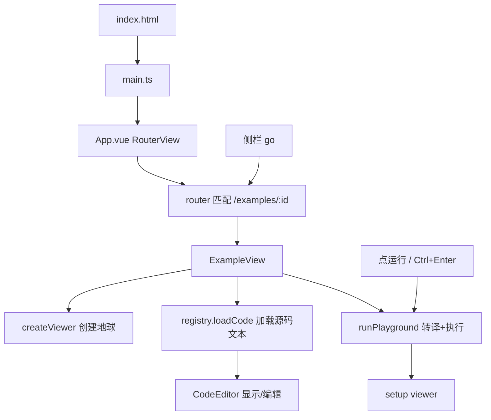

这是一个 **Vue 3 + Vite + Cesium** 的本地案例平台。`App.vue` 本身几乎不做业务，真正干活的是路由、`ExampleView`、以及 `createViewer` / `runPlayground`。

---

## 总览：一次完整启动链路

```
npm run dev (Vite)
    → 打开 index.html
    → 加载 src/main.ts
    → 挂载 App.vue
    → RouterView 渲染 ExampleView
    → 创建 Cesium Viewer
    → 加载案例源码 → 转译执行 → setup(viewer)
```

---

## 第 0 步：你怎么把项目跑起来

1. `npm install`：装依赖；`postinstall` 会把 Monaco 拷到 `public/monaco`（离线编辑器用）
2. `npm run dev`：启动 Vite（配置里端口是 **5176**，并 `open: true`）
3. 浏览器打开页面后，从 `index.html` 开始

`index.html` 只有一个空壳：

```html
<div id="app"></div>
<script type="module" src="/src/main.ts"></script>
```

---

## 第 1 步：`main.ts` — 应用入口

```ts
createApp(App).use(router).mount('#app')
```

| 动作 | 作用 |
|------|------|
| `createApp(App)` | 创建 Vue 应用，根组件是 `App.vue` |
| `.use(router)` | 注册 vue-router |
| `.mount('#app')` | 挂到页面的 `#app` |
| `import './style.css'` | 全局样式（全屏、暗色底等） |

---

## 第 2 步：`App.vue` — 只做路由出口

你贴的这 8 行：

```1:8:src/App.vue
<script setup lang="ts">
import { RouterView } from 'vue-router'
</script>

<template>
  <RouterView />
</template>
```

**它不包含任何业务逻辑。**  
`<RouterView />` 的意思是：根据当前 URL，把匹配到的页面组件渲染在这里。

当前几乎永远会渲染 `ExampleView.vue`。

---

## 第 3 步：路由 `src/router/index.ts` — 决定显示谁

| 路由 | 行为 |
|------|------|
| `/` | 重定向到第一个案例，如 `/examples/hello-world` |
| `/examples/:id` | 懒加载 `ExampleView.vue` |
| 其它路径 | 回到 `/` |

`examples[0]?.id` 来自案例注册表，所以首页打开的就是注册表里的第一个案例。

---

## 第 4 步：案例注册表 `registry.ts` — 侧栏和源码从哪来

**数据结构 `ExampleMeta`**：`id / title / group / description / loadCode`

| 函数 | 作用 |
|------|------|
| `examples` 数组 | 所有案例清单 |
| `getExampleById(id)` | 按 id 查一个案例 |
| `groupExamples()` | 按 `group` 分组，给侧栏用 |
| `loadCode()` | `import('.../playground.ts?raw')`，把源码当**纯文本**加载进编辑器 |

`?raw` 很关键：不是执行这个 TS，而是把文件内容当字符串交给 Monaco 编辑。

---

## 第 5 步：进入 `ExampleView.vue` — 真正的主页面

布局：

- 左：`AppSidebar`（案例列表）
- 中：Cesium 地球容器
- 右：`CodeEditor`（Monaco）
- 顶：标题 + 运行 / 重置 / 重建地球

### 挂载时发生了什么（`onMounted`）

1. `createViewer(cesiumContainer)` → 创建地球
2. `loadExampleCode(exampleId)` → 按路由 id 加载源码并自动运行

### 各函数职责

| 函数 | 干什么 |
|------|--------|
| `loadExampleCode(id)` | 查注册表 → `loadCode()` 取源码字符串 → 赋给 `code` / `originalCode` → 调用 `runCurrentCode()` |
| `runCurrentCode()` | 先清掉上一次案例 → `runPlayground(code)` 转译执行 → 调 `setup(viewer)` |
| `resetCode()` | 把编辑器代码恢复成原始源码，再运行 |
| `recreateViewer()` | 销毁并重建整个 Viewer（场景坏了时用） |
| `watch(exampleId)` | 侧栏切换案例时，重新加载对应源码并运行 |
| `onBeforeUnmount` | 调 `destroy`、销毁 Viewer，防泄漏 |

### `runCurrentCode` 内部顺序（核心）

```
1. currentDestroy?.()          // 调上一次案例的 destroy
2. resetViewerContent(viewer)  // 清空 entities / dataSources
3. runPlayground(code)         // 把编辑器文本变成可执行模块
4. await module.setup(viewer)  // 执行案例逻辑
5. 保存 module.destroy         // 下次切换/重跑时清理
```

---

## 第 6 步：`createViewer.ts` — 怎么造出地球

`createViewer(container, options?)`：

1. 读环境变量 `VITE_CESIUM_TOKEN`
2. 有 Token → 设 `Ion.defaultAccessToken`（可用 Cesium Ion 默认影像）
3. 没 Token → 用 OpenStreetMap 底图（纯本地也能看）
4. `new Viewer(...)`，关掉动画条、时间轴、搜索等一堆控件
5. 有 Token 且不要求显示版权时，隐藏 credit 条
6. 返回 `viewer`

保证每个案例的初始环境一致。

---

## 第 7 步：`runPlayground.ts` — 编辑器里的代码怎么“跑起来”

### `runPlayground(code)`

1. **sucrase** 把 TypeScript 转成普通 JS（去掉类型）
2. 用 `new Function('Cesium', 代码 + 返回 {setup, destroy})` 动态执行
3. 把真实的 `Cesium` 对象当参数注入进去（所以 playground 里不能写 `import`，直接用 `Cesium.xxx`）
4. 要求必须有 `setup`；没有 `destroy` 就给空函数
5. 成功返回 `{ ok: true, module }`，失败返回 `{ ok: false, error }`

### `resetViewerContent(viewer)`

- `entities.removeAll()`
- `dataSources.removeAll()`
- `clock.shouldAnimate = false`

只清常见残留；定时器、事件监听要靠案例自己的 `destroy()`。

---

## 第 8 步：侧栏与编辑器

### `AppSidebar.vue`

| 函数 | 作用 |
|------|------|
| `groupExamples()` | 拿到分组后的列表 |
| `go(id)` | `router.push('/examples/' + id)`，触发 `ExampleView` 的 `watch` |

### `CodeEditor.vue`

| 函数 | 作用 |
|------|------|
| `loader.config` | Monaco 从 `/monaco/vs` 本地加载 |
| `onUpdate` | `v-model` 双向绑定编辑内容到父组件的 `code` |
| `onMount` | 注册 `Ctrl/⌘ + Enter` → `emit('run')` → 父组件 `runCurrentCode` |

---

## 第 9 步：一个案例长什么样（hello-world）

```ts
async function setup(viewer) {
  viewer.camera.setView({
    destination: Cesium.Cartesian3.fromDegrees(105.0, 33.0, 8_000_000),
  })
}

function destroy() {
  // 可选清理
}
```

平台注入了 `Cesium`，并传入已创建好的 `viewer`。你改经纬度点「运行」，就会再走一遍 `runCurrentCode`。

---

## 用一张图串起来



---

## 一句话记住职责

| 文件 | 一句话 |
|------|--------|
| `App.vue` | 路由出口，无业务 |
| `router` | URL → 哪个页面 |
| `registry` | 有哪些案例、源码从哪加载 |
| `ExampleView` | 页面编排：地球 + 编辑器 + 运行流程 |
| `createViewer` | 统一创建 Cesium Viewer |
| `runPlayground` | 把编辑器文本变成可执行的 `setup/destroy` |
| playground 文件 | 真正的 Cesium 教学/演示代码 |
